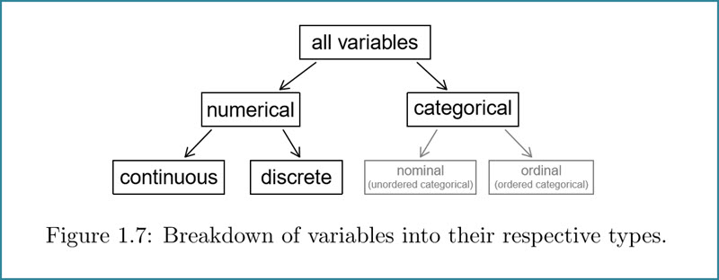

## factors - R's implementation of categorical variables


Source: [OpenIntro.org](https://www.openintro.org/)

## load libraries

```{r}
library(tidyverse)
```

##  Does character data read into an R dataframe become factors or strings?

##  Does character data read into an R dataframe become factors or strings?

```{r}
airlines_url = "https://raw.githubusercontent.com/acatlin/data/master/airlines.csv"
airlines <- read.csv(airlines_url, stringsAsFactors = TRUE); head(airlines,3)
str(airlines)
```

##  How do I load character data as string data?  

##  How do I load character data as string data?  What's the default??

Load character data as character vectors instead of factors

```{r}
airlines2 <- read.csv(airlines_url, stringsAsFactors = FALSE); head(airlines2,3)
str(airlines2)
```

## How do I load from dropbox instead of my local file system?

## How do I load from dropbox instead of my local file system?

Note new default behavior when loading character data 
repmis prompts you to create a local cache folder on first load

```{r eval=FALSE}
#install.packages("repmis")
library("repmis")
airlines <- source_DropboxData(file = "airlines.csv", 
        key = "m1h7syyien0zdl8", sep = ",", header = TRUE)
```

```{r}
str(airlines)
```

## Some functions work differently--or not at all--with factor data

## Some functions work differently--or not at all--with factor data

```{r}
# str(airlines$carrier);str(airlines2$carrier)
# class(airlines$carrier); class(airlines2$carrier)
# nchar(airlines$carrier) # not valid
nchar(airlines2$carrier)  

airlines3 <- as.character(airlines2$carrier); str(airlines3)
airlines4 = as.factor(airlines3); str(airlines4)
```


## How do I change the order of factor levels?

## How do I change the order of factor levels?
```{r}
sizes <- factor(c("small", "large", "large", "small", "medium"))
sizes

sizes <- factor(sizes, levels = c("small", "medium", "large"), 
                ordered = TRUE)
sizes
```

## How do I label factors?

## How do I label factors?

```{r}
humidity <- c("L", "H", "H", "L", "M", "M")
humidity <- factor(humidity, levels = c("L", "M", "H"), 
               ordered = TRUE,
               labels = c("Low", "Medium", "High"), )
table(humidity)

which(humidity == "High")
```


## How do I use tapply() to apply a function to every group?

## How do I use tapply() to apply a function to every group?

tapply(x,f,g) where x is a vector, f is a factor or list of factors, and g is a function

```{r}
ages <- c(25, 26, 55, 37, 21, 42)
affils <- c("R","D","D","R","U","D")
tapply(ages, affils, mean)
```

## How do I use tapply() over more than one set of factors at once?

## How do I use tapply() over more than one set of factors at once?

baseR  (apply family) -> plyr -> dplyr -> purrr

```{r}
d <- 
  data.frame(gender=c("M","M","F","M","F","F"),
   age=c(47,59,21,32,33,24), income=c(55000,88000,34250,76500,123000,45465))
d$over25 <- ifelse(d$age > 25, 1, 0); # head(d)
tapply(d$income, list(d$gender, d$over25), mean)

```

## What would be a Tidyverse implementation of baseR's tapply?

## What would be a Tidyverse implementation of baseR's tapply?

```{r}
d <- 
  data.frame(gender=c("M","M","F","M","F","F"),
   age=c(47,59,21,32,33,24), income=c(55000,88000,34250,76500,123000,45465))
d$over25 <- ifelse(d$age > 25, 1, 0);

d %>% 
  group_by(over25) %>% 
  summarise_at(vars(income), mean)
```


## How do I create a factor from continuous data?  Why would I want to?

## How do I create a factor from continuous data?  Why would I want to?

binning - splitting data into groups according to intervals

```{r}
x <- rnorm(100); #x[1:5]
breaks <- c(-3,-2,-1,0,1,2,3)
f <- cut(x, breaks); #f
summary(f)

f <- cut(x, breaks, labels=c("Bottom","Low","Neg","Pos","High","Top")); # f
summary(f)
```

## How do I create a box plot by factor level (1/2)?

## How do I create a box plot by factor level (1/2)?

```{r warning=FALSE}
library(MASS)
data(Cars93, package="MASS"); #str(Cars93); head(Cars93)
boxplot(Cars93$Horsepower)
```

## How do I create a box plot by factor level (2/2)?

## How do I create a box plot by factor level (2/2)?
```{r warning=FALSE}
library(MASS)
data(Cars93, package="MASS")
boxplot(Horsepower ~ Origin, data=Cars93)
```

## How do I create multiple scatterplots, one for each factor level?

## How do I create multiple scatterplots, one for each factor level?
```{r warning=FALSE}
library(MASS); data(Cars93, package="MASS")
coplot(Horsepower ~ MPG.city | Origin, data=Cars93)
```

## TO DO:  For the diamonds dataset in ggplot2 package, what is the average price of a diamond for each cut?

## TO DO:  For the diamonds dataset in ggplot2 package, what is the average price of a diamond for each cut?

```{r warning=FALSE}
library(ggplot2); #str(diamonds); View(diamonds)
tapply(diamonds$price, diamonds$cut, mean)
```

## sources
+   Art of R Programming, Norman Matloff
+   R Cookbook, Paul Teetor
+   Reading Data Into R from a Secure Dropbox URL, Aaron R. Baggett, http://aaronbaggett.com/notes/2014/03/28/reading-secure-data-into-r-from-dropbox/.  Mar 28, 2014.
+  http://www.cookbook-r.com/Manipulating_data/Changing_the_order_of_levels_of_a_factor/

## other resources

+ R for Data Science, ch 15 "Factors", https://r4ds.had.co.nz/factors.html
+ discussion of *apply functions, https://stackoverflow.com/questions/3505701/grouping-functions-tapply-by-aggregate-and-the-apply-family
+ purrr map functions
+ purrr tutorial, https://jennybc.github.io/purrr-tutorial/bk01_base-functions.html
+ purrr cheat sheet, https://evoldyn.gitlab.io/evomics-2018/ref-sheets/R_purrr.pdf